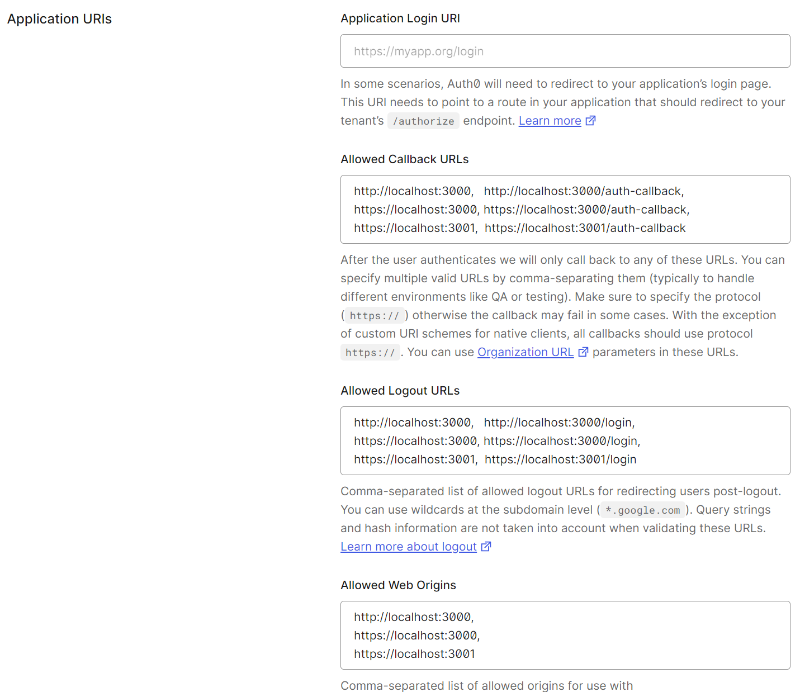

# nuxt-3-auth0

Playground for Nuxt 3 + Auth0

`@auth0/auth0-vue` library is used.

# Getting started

Nuxt 3 Auth0 demo app.


## Demo

<table>
<tr><td>Url</td><td><a href="https://nuxt-3-auth0.vercel.app/login">nuxt-3-auth0/login</a></td></tr>
<tr><td>Username</td><td>hello@world.com</td></tr>
<tr><td>Password</td><td>H3lloworld!</td></tr>
</table>

## Auth flow in this demo.

Authorize Code with PKCE.

## Prerequisite

- You need to have an Auth0 account with Auth0 apps.
- The `.env` must be updated with values from the Auth0 settings.
- The backend API must be running if API demo is wanted.

## Install steps:

```bash
# Ensure you have mkcert installed to use https in localhost. https://github.com/FiloSottile/mkcert

npm install

npm run create-env # creates a boilerplate .env file
# Update the .env file with your Auth0 config data.

npm run install-mkcert # Done with your normal OS account. Done once per OS, skip if has been done for your OS.

# Works with Bash shell
npm run create-cert-files-in-folder # Creates the localhost certificates.

# Ensure your backend is running if API fetch is wanted.

npm start # Starts the app using https. Done with your normal OS account.
```

# Auth setup

https://auth0.com/

Login or create an account.





## Thoughts

You can use `'@auth0/auth0-spa-js'` and create a Vue wrapper if `@auth0/auth0-vue` is lacking req. features.
